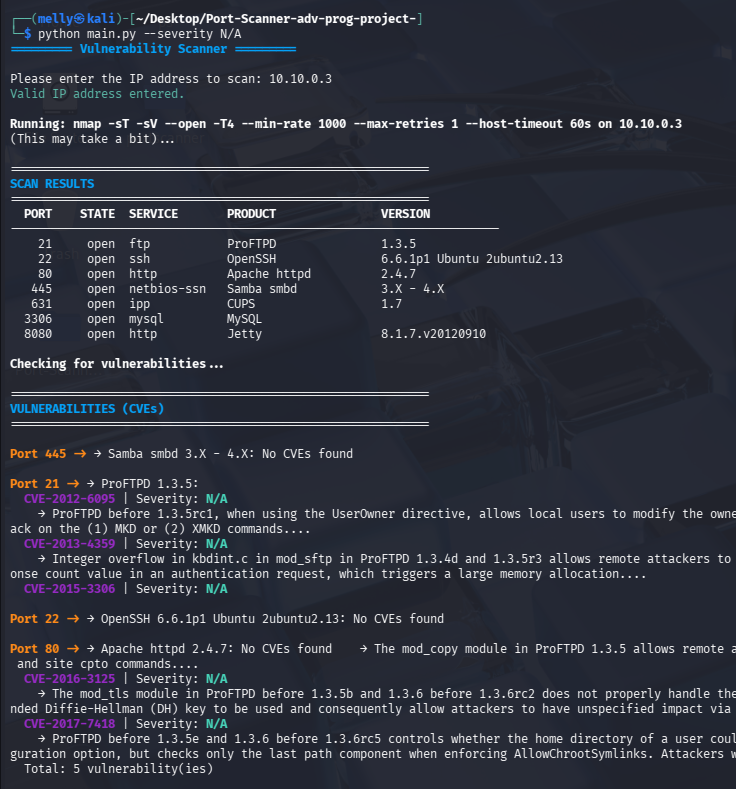

# Port & Vulnerability Scanner


A comprehensive **Python-based vulnerability scanner** that identifies open ports, service versions, and associated **CVEs** using the **NIST NVD database**.  
Built for **security assessments** and **penetration testing**.

---

## Features

- **Port Scanning**: Uses Nmap to discover open ports and services  
- **Service Detection**: Identifies software products and versions running on open ports  
- **CVE Lookup**: Automatically queries the NVD (National Vulnerability Database) for known vulnerabilities  
- **Risk Scoring**: Categorizes vulnerabilities by severity (CRITICAL, HIGH, MEDIUM, LOW, N/A)  
- **Parallel Processing**: Scans multiple services concurrently for faster results  
- **Filtering**: Filter results by severity level  
- **Color-coded Output**: Easy-to-read console output with color-coded severity levels  

---
## How It Works
### 1- ️ Port Scanning Phase

- Uses Nmap with aggressive timing
- Performs service version detection (-sV)
- Displays only open ports (--open)

### 2 Service Enumeration
- Extracts product name and version
- Builds a service list for CVE checks

### 3-  Vulnerability Detection

- Queries NVD API per service

- Matches by product + version

- Prioritizes CVSS v3.1 → v3 → v2

### 4- Results Presentation

- Displays formatted tables

- Groups CVEs per service

- Color-coded severity levels

---
##  Project Structure
``` text
Port-scanner/
├── main.py                    # Main entry point
├── config.py                  # Configuration settings
├── setup.py 
├── scanner/
│   ├── __init__.py
│   ├── port_scanner.py       # Nmap-based port scanning
│   └── cve_scanner.py        # CVE lookup and parsing
├── utils/
│   ├── __init__.py
│   ├── network.py           # Network utilities
│   └── api_client.py        # NVD API client
├── ui/
│   ├── __init__.py
│   ├── colors.py            # Color definitions for console
│   └── observers.py         # Observer pattern for results display
└── README.md
```
---
## Scan with Severity Filter
``` bash
# Show only CRITICAL vulnerabilities
python main.py --severity CRITICAL

# Show HIGH and CRITICAL vulnerabilities
python main.py --severity HIGH

# Show LOW and N/A vulnerabilities
python main.py --severity LOW

```
---
##  Prerequisites

- Python **3.8+**
- **Nmap** installed and accessible via command line
- Internet connection (for NVD API queries)

---

##  Installation

### Clone the repository
```bash
git clone https://github.com/sarak2005/Port-Scanner-adv-prog-project-.git
python main.py (optional : --severity X)
```

### Install Python dependencies
```bash 
pip install python-nmap requests
```

### Install Nmap - Linux:
```bash 
sudo apt-get install nmap
```
### NVD API Key (Optional but recommended)

- Get a free API key from the NVD API Portal
- Add it to config.py in the HEADERS section


---
## Example Output
<p align="center">
  
</p>
